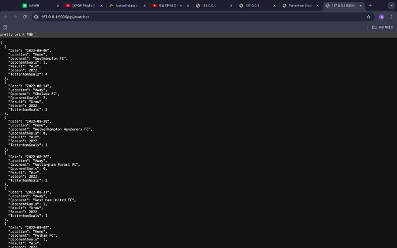
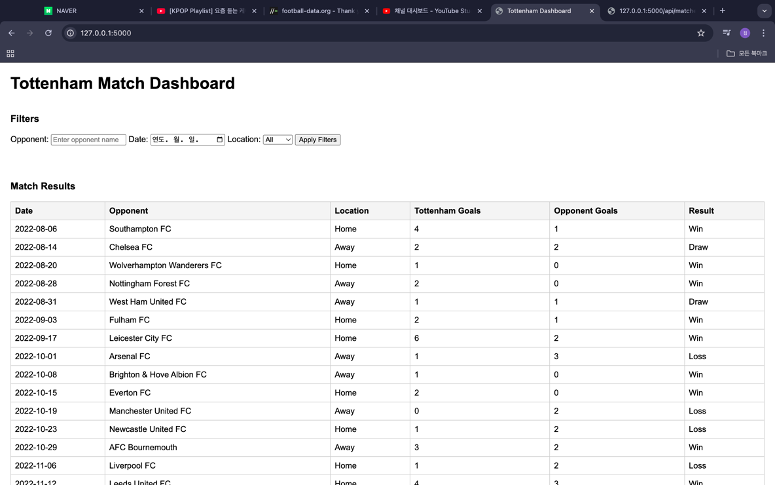
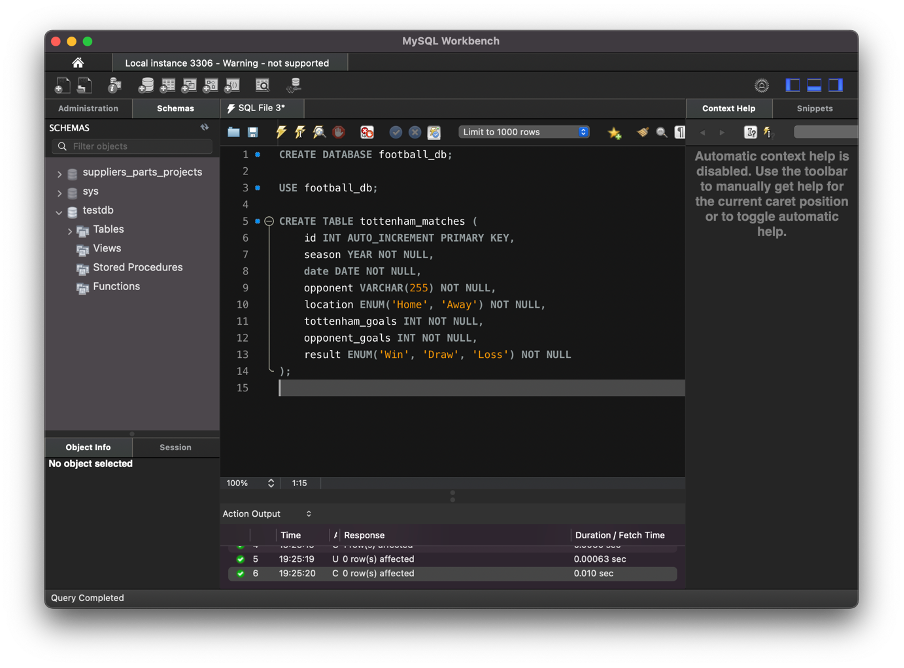
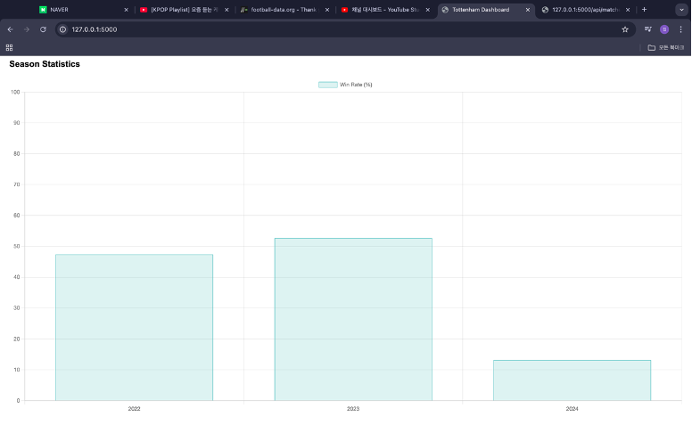

# ⚽ TottenhamMatchDashboard

**A web application for analyzing and visualizing Tottenham Hotspur's match statistics using interactive dashboards.**

---

## 🏆 Project Overview

TottenhamMatchDashboard is an interactive web dashboard that visualizes Tottenham Hotspur's match performance, league standings, and team statistics.  
It connects to a MySQL database to manage structured football data, and fetches real-time updates using the [Football-Data.org](https://www.football-data.org/) API.

---

## 🛠️ Tech Stack

### Languages  
[](https://developer.mozilla.org/en-US/docs/Web/HTML)
[](https://developer.mozilla.org/en-US/docs/Web/CSS)
[](https://developer.mozilla.org/en-US/docs/Web/JavaScript)

### Backend & Database  
[](https://nodejs.org/)
[](https://expressjs.com/)
[](https://www.mysql.com/)

### Libraries & Tools  
- `Chart.js`: Data visualization  
- `Fetch API`: Client-server communication  
- `Bootstrap`: UI layout & responsive design

### API  
- [Football-Data.org](https://www.football-data.org/): Real-time football match data

---

## 🔍 Key Features

### 1. Match Schedule & Results
- Displays match timeline and results for Tottenham Hotspur
- Visualizes key match events using bar charts

### 2. Team Statistics
- Compares stats like possession rate, shots, and goals per opponent
- Line charts for side-by-side comparison

### 3. League Standings
- Premier League table with live updates
- Highlights relegation zone teams in red

### 4. Interactive Dashboard
- Filters by date, stat type, and opponent

---

## 🧩 Architecture Overview

### 🔧 MySQL Integration
- Backend communicates with MySQL to store match data  
- Tables: `matches`, `teams`, `stats`, `events`

### 🔁 System Flow  
<p align="center">
  
</p>

---

## 🖼️ Screenshots

### 🔷 Main Dashboard Page
<p align="center">
  
</p>

### 🧠 MySQL Database Schema
<p align="center">
  
</p>

### 📊 Match Result Chart
<p align="center">
  
</p>

---

## 🚀 How to Run

```bash
# 1. Clone the repository
git clone https://github.com/username/TottenhamMatchDashboard.git

# 2. Install dependencies
npm install

# 3. Set up your MySQL database
# Import ./db/schema.sql and update your .env file

# 4. Start the server
node index.js

# 5. Access via browser
http://localhost:5000
